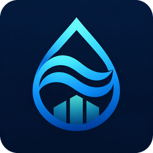
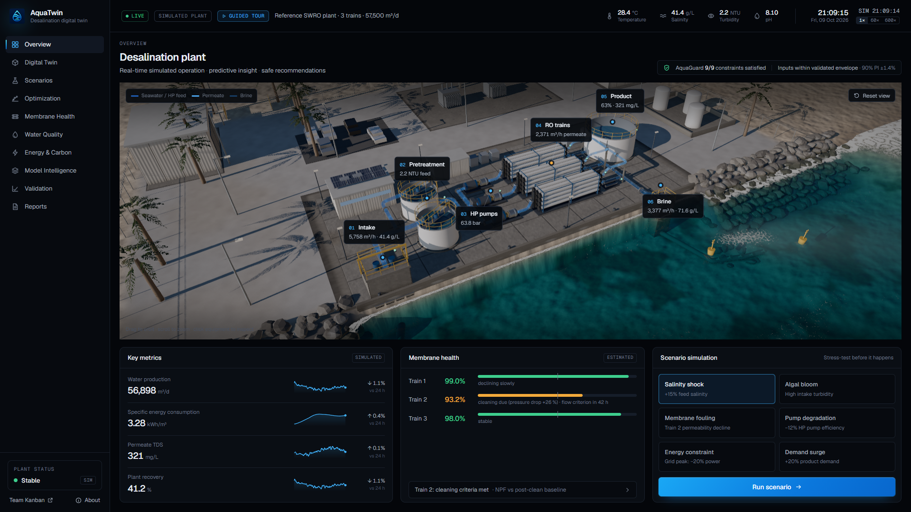

# AquaTwin

**A physics-informed, self-calibrating digital twin for resilient and safe seawater desalination.**

Built by [Team Kanban](https://kanbanstudios.ae/team-kanban) for the Khalifa University–UNESCO Global Water Hackathon 2026, theme *Smart, Digital, and AI-Enabled Water Systems* (registration CMAT-00022). Registered title: *AquaTwin: A Physics-Informed AI Digital Twin for Autonomous Desalination Optimization*.

AquaTwin watches a seawater reverse-osmosis (SWRO) plant through the signals it already records, keeps a reduced-order physical model calibrated to it in real time, corrects that model with a machine-learning residual, forecasts membrane fouling and the effect of disturbances, and recommends operating strategies, but only after a deterministic safety layer, **AquaGuard**, has checked every limit at the edge of the model's uncertainty. When the plant leaves the conditions the model knows, AquaTwin says so and withholds its recommendation.

**Live:** [aquatwin.kanbanstudios.ae](https://aquatwin.kanbanstudios.ae) runs entirely in the browser; best on a desktop with a dedicated GPU, and usable on phones and tablets. Press **Guided tour** in the top bar for a six-step walk through the evidence. **One-minute film:** [`public/media/aquatwin-film.mp4`](public/media/aquatwin-film.mp4) (motion graphics as code, source in [`video/motion`](video/motion)), also on the app's About page. **Final report:** [`report/AquaTwin-Report.pdf`](report/AquaTwin-Report.pdf).

> **Status: research prototype on a simulated plant.** The "plant" is a higher-fidelity reference simulator that stands in for a real facility, so that every claim can be tested against known ground truth. Nothing here has been validated on an industrial plant, and no organisation has endorsed it. Every number in the interface is labelled *simulated*, *modeled*, *estimated* or *external reference*.



## What it does

| Layer | In AquaTwin |
|---|---|
| Physics | Reduced-order solution–diffusion model per RO train, self-calibrated from noisy telemetry (A, B, ΔP coefficient, pump efficiency). |
| Residual ML | Gradient-boosted trees learn what the physics misses; **physics prediction + ML residual = AquaTwin prediction**. |
| Uncertainty | 90 % split-conformal intervals; Mahalanobis distance to the training data; low confidence ⇒ recommendation withheld. |
| Degradation | Normalised permeate flow / salt passage / ΔP (ASTM D4516 concept) and a fitted fouling model with a cleaning-threshold forecast. |
| Scenarios | 24-h forecasts of six disturbances: *no action* vs *AquaTwin response*. |
| Optimiser | 676 candidate strategies scored on energy, water quality, production, membrane stress and fouling. |
| AquaGuard | Deterministic hard constraints: APPROVED / REJECTED (with reasons) / WITHHELD. |

Validation on the simulator ([docs/VALIDATION.md](docs/VALIDATION.md)): the hybrid predicts permeate flow with 4.9 m³/h mean absolute error per train inside the training envelope (physics 48.0, ML-only 9.7) and 12.1 outside it (ML-only 35.1). In closed loop it removes the constraint violations that fixed operation incurs under the salinity shock, energy cap and demand surge, also when these start at any of six times of day (from storage close to its reserve, no method avoids every violation), typically at equal or slightly higher specific energy, and it warns that a membrane train will reach the flow cleaning criterion about 12 h ahead, where conventional alarms give no warning. Outside its envelope it fails like every other method, and withholds its recommendations.

## Quick start

Requirements: Node.js 20+ (developed on 24), npm; a WebGL2-capable browser (Chrome or Edge recommended). Python 3.12 is only needed to retrain the models or rebuild the report.

```bash
npm install
npm run dev
```

Open http://localhost:3000. The intro plays once per browser session on the Overview page (skip with Esc; add `?intro=1` to replay, `?intro=0` to skip).

Production build (static export to `out/`, served locally with Wrangler at http://localhost:3200):

```bash
npm run build
npm run start
```

Deployment: the static export is served by Cloudflare Workers static assets (`wrangler.jsonc`), with a small Worker (`worker/index.ts`) that answers byte-range requests for `/media/*` so the film plays on iOS; `npm run deploy` builds and deploys it (requires access to the Cloudflare account).

The trained model (`public/data/models/`) and the experiment results (`public/data/validation/`) are committed, so the app runs without Python.

## Reproduce the science

```bash
pip install -r ml/requirements.txt
npm run pipeline          # dataset → training → TS/sklearn parity check → experiments (~12 min)
python scripts/report/validation_md.py   # regenerate docs/VALIDATION.md from the results
npm test                  # unit tests: physics, safety layer, ML parity
```

| Script | What it does |
|---|---|
| `npm run data:generate` | Synthetic dataset from the reference plant (seed 20261101) → `data/ml/`, fitted degradation model → `public/data/models/degradation.json` |
| `npm run ml:train` | Trains hybrid and ML-only models, conformal intervals, OOD statistics → `public/data/models/` |
| `npm run ml:parity` | Checks the browser tree runtime against scikit-learn (tolerance 1e-9) |
| `npm run experiments` | Closed-loop experiments: 10 scenarios × 4 methods × 5 seeds → `public/data/validation/results.json`, `data/experiments/` |
| `npm run qa:capture` / `npm run qa:perf` / `npm run qa:mobile` | Screenshot / console / rendering-performance QA in Chrome, and phone/tablet layout checks (Python Playwright) |
| `npm run typecheck`, `npm run lint`, `npm test` | Static checks and unit tests |

All steps are deterministic (fixed seeds, no early stopping); rerunning the pipeline reproduces the committed artefacts.

## Pages

1. **Overview**: live 3D twin, plant status, key metrics, membrane health, scenario launcher.
2. **Digital Twin**: process flow and a per-subsystem view of inputs, physics, measured value, ML residual and final estimate.
3. **Scenario Lab**: "Stress-test the plant before the plant is stressed." Baseline vs disturbance vs AquaTwin response over 24 h.
4. **Optimization**: candidate strategies, Pareto set, AquaGuard verdicts, current vs recommended (shadow mode).
5. **Membrane Health**: normalised performance, projection to the cleaning threshold, why a train is flagged.
6. **Water Quality**: feed and permeate chemistry, safe-operating envelope, hard constraints.
7. **Energy & Carbon**: energy by stage, energy-recovery contribution, SEC under scenarios, estimated carbon.
8. **Model Intelligence**: every layer's inputs, outputs and method; model card; out-of-distribution probe.
9. **Validation**: experiment results read directly from the result files.
10. **Reports**: run records with PDF / JSON / CSV export.
11. **About**: credits, data provenance, methods, software, disclaimers.

## Documentation

- [docs/MODEL.md](docs/MODEL.md): equations, parameters, provenance, limitations
- [docs/VALIDATION.md](docs/VALIDATION.md): experiment design and results (generated from the data)
- [docs/ARCHITECTURE.md](docs/ARCHITECTURE.md): system design, 3D engine, WebGL2/WebGPU decision, path to a real plant
- [docs/REFERENCES.md](docs/REFERENCES.md): sources, with what was and was not verified
- [docs/QA.md](docs/QA.md): quality-assurance report
- [report/](report/): final report (PDF and editable source), structured by the hackathon's evaluation criteria
- [docs/research/submission-fact-check.md](docs/research/submission-fact-check.md): sources for the policy, SDG and industry claims in the report
- [video/motion/](video/motion/): the one-minute film (script, voiceover, plates, sound cue sheet)
- [docs/brand/](docs/brand/): the master logo; `scripts/brand/make_assets.py` derives every icon, the transparent mark and its vector trace

## Technology

Next.js 16 (App Router, Turbopack) · React 19 · TypeScript · Tailwind CSS 4 · three.js r186 (WebGL2) · d3-scale/d3-shape · zustand · Web Workers · Python 3.12 · scikit-learn 1.9 · vitest · Playwright (QA).

No language model is used for any prediction, control or safety decision.

## Credits

Concept, engineering, modelling and design: [Team Kanban](https://kanbanstudios.ae/team-kanban). Open-source software as listed on the About page, under their respective licences. Scientific sources in [docs/REFERENCES.md](docs/REFERENCES.md).
