<!--
  AquaTwin final report: editable source.
  Build the HTML and PDF with:  python scripts/report/build.py
  Figures are generated from the experiment files by scripts/report/figures.py;
  screenshots come from scripts/qa/screenshots.py (the running application).
  Facts outside the project's own results are checked in docs/REFERENCES.md and
  docs/research/submission-fact-check.md.
-->

<section class="cover">
<div class="cover-head">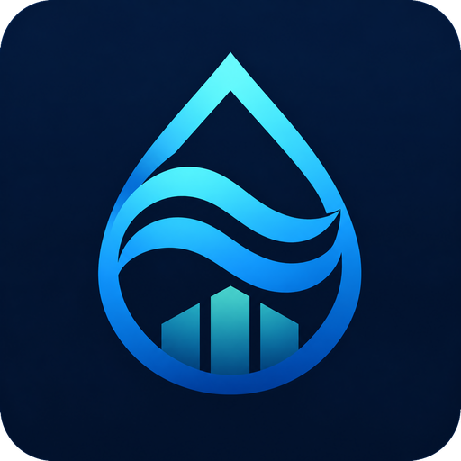<div><div class="cover-kicker">Khalifa University–UNESCO Global Water Hackathon 2026 · Final report</div><div class="cover-theme">Theme 3 · Smart, Digital, and AI-Enabled Water Systems</div></div></div>
<h1>Aqua<span class="grad">Twin</span></h1>
<p class="cover-sub">A Physics-Informed AI Digital Twin for Autonomous Desalination Optimization</p>
<p class="cover-tag">A self-calibrating digital twin of a seawater reverse-osmosis plant that rehearses disturbances before they happen, checks every recommendation against hard limits at the edge of its uncertainty, and withholds its advice when conditions leave what it has learned.</p>

<div class="glance">
<div><b>4.9 m³/h</b><span>permeate-flow prediction error per train (physics alone 48.0, machine learning alone 9.7)</span></div>
<div><b>21.3 h → 0 h</b><span>hours breaking a limit under a +15 % salinity shock: fixed setpoints vs AquaTwin</span></div>
<div><b>12.5 h</b><span>warning before a membrane train reaches the flow cleaning criterion; conventional alarms give none</span></div>
<div><b>77 %</b><span>of out-of-envelope conditions recognised; advice withheld (0.01 % false withholds)</span></div>
</div>
<p class="glance-note">Simulated results on a hidden reference plant, 5 seeds (Section 4.8). Live prototype: <a href="https://aquatwin.kanbanstudios.ae">aquatwin.kanbanstudios.ae</a> · source: <a href="https://github.com/4waiz/AquaTwin">github.com/4waiz/AquaTwin</a></p>
<div class="cover-meta">
<div><span>Registration</span><b>CMAT-00022</b></div>
<div><span>Team</span><b><a href="https://kanbanstudios.ae/team-kanban">Team Kanban</a> · United Arab Emirates</b></div>
<div><span>Team leader</span><b>Eng. Awaiz Ahmed</b></div>
<div><span>Members</span><b>Eng. Huda Mueen · Eng. Inshal Syed · Eng. Mohammad Umar · Eng.&nbsp;Bilal&nbsp;Feroz</b></div>
<div><span>Faculty advisor</span><b>Dr. Khubaib Alam</b></div>
<div><span>Industry mentor</span><b>Dr. Yazeed Ghadi</b></div>
</div>
<p class="cover-note">{{DATE}} · Research prototype evaluated on a simulated seawater reverse-osmosis plant. All performance figures are simulation results or model estimates and are labelled as such. No organisation named in this report has reviewed or endorsed AquaTwin.</p>
</section>

## Executive summary

**The problem.** Seawater reverse osmosis (SWRO) supplies a large and growing share of drinking water in the UAE and the Gulf, where seawater is saltier, warmer and more variable than almost anywhere else. Plants are still run largely on fixed setpoints and fixed alarm thresholds: operators learn that permeate quality is drifting, that a membrane train needs cleaning or that storage is running low when a threshold is crossed, when the plant is already reacting. Machine learning could anticipate these events, but black-box models extrapolate silently when conditions leave what they were trained on, which is exactly when a plant is under stress.

**The solution.** **AquaTwin** keeps a reduced-order physical model of each RO train calibrated to noisy plant telemetry in real time, corrects the model's systematic errors with a machine-learning residual (*physics prediction + ML residual = AquaTwin prediction*), attaches a calibrated 90 % interval to every prediction, forecasts membrane fouling, and rehearses six kinds of disturbance 24 hours ahead. An optimiser proposes operating strategies; a deterministic safety layer, **AquaGuard**, approves only those that satisfy every hard limit at the conservative edge of the uncertainty, and when inputs leave the validated envelope, AquaTwin **withholds** its advice instead of guessing. No language model is used for any prediction, control or safety decision.

**The evidence (all simulated).** We built the complete product, an 11-view web application with a live 3D twin deployed at [aquatwin.kanbanstudios.ae](https://aquatwin.kanbanstudios.ae), and tested it against a hidden, higher-fidelity plant simulator whose true state is known: 14,000 held-out predictions, 200 closed-loop runs (10 scenarios × 4 methods × 5 seeds) and a 216-run robustness sweep (3 scenarios × 6 start times × 3 storage levels × 4 methods).

- **Prediction:** permeate flow within 4.9 m³/h per train inside the training envelope (calibrated physics 48.0, ML alone 9.7); outside it 12.1 against 35.1 for ML alone.
- **Closed loop:** under a +15 % salinity shock, fixed setpoints break a limit for 21.3 of 24 hours; AquaTwin for none. Under a grid power cap and a +20 % demand surge, violations fall from 6.0 h and 15.3 h to zero, at 0 to +2.8 % specific energy (no energy saving is claimed).
- **Early warning:** a membrane train reaching the flow cleaning criterion is flagged 12.5 h ahead, where conventional alarms give no warning; storage depletion 6.8 h ahead versus 1.3 h.
- **Knowing its limits:** the withhold rule recognises 77 % of out-of-envelope conditions with 0.01 % false withholds; in a compound extreme every method fails, and AquaTwin withholds its advice 20 times in 24 hours, as designed.

**Why it matters.** AquaTwin serves SDG 6 (targets 6.1, 6.4 and 6.a) and the UAE Water Security Strategy 2036, and beyond its own theme it contributes to all five other hackathon themes, three of them strongly. It needs no new sensors, runs in a browser, and is designed to be connected read-only to a plant historian and run in **shadow mode**: the first step of a staged, auditable path from advice to supervised autonomy.

<table class="rubric">
<thead><tr><th>Evaluation criterion</th><th>Weight</th><th>Where it is addressed</th></tr></thead>
<tbody>
<tr><td><b>Scientific and technical rigor</b></td><td>30 %</td><td>§4: hidden-plant validation, physics + residual ML, conformal uncertainty, closed-loop experiments, limitations; Appendix B reproduces every number</td></tr>
<tr><td><b>Alignment with the UN Water pillars</b></td><td>20 %</td><td>§5: the six themes, SDG 6 targets, SDG 6 Global Acceleration Framework, UN 2026 Water Conference dialogues, impact and policy brief</td></tr>
<tr><td><b>Feasibility and scalability</b></td><td>20 %</td><td>§6: data, integration, cybersecurity, resources, phased pathway, scaling from train to fleet, risks</td></tr>
<tr><td><b>Industry relevance and adoption potential</b></td><td>15 %</td><td>§7: stakeholders, value, industry-adoption roadmap, autonomy ladder, business model, standards</td></tr>
<tr><td><b>Quality of communication and presentation</b></td><td>15 %</td><td>§8: live prototype, one-minute film, provenance labels; Appendix A</td></tr>
</tbody></table>

## 1. The problem

### 1.1 Desalination is critical infrastructure, above all in the Gulf

Around 16,000 desalination plants produce about 95 million m³ of water per day worldwide, 48 % of it in the Middle East and North Africa; reverse osmosis accounts for 69 % of output [1]. In the UAE, desalination is a key source of water, particularly for drinking and domestic use, with an installed capacity of about 7.8 million m³ per day in 2023 [2]. New capacity is predominantly SWRO: the Taweelah plant in Abu Dhabi alone is rated at about 909,000 m³ per day [3]. The UAE Water Security Strategy 2036 aims to ensure continuous access to water in normal and emergency conditions, with targets including a 21 % reduction in total water demand and national storage of up to two days [4]. Every hour a large SWRO plant runs off-specification, below demand or towards an unplanned cleaning is a cost to supply security.

### 1.2 Gulf seawater makes operation hard

Gulf seawater typically exceeds 39 g/kg salinity and ranges from about 14 °C to above 36 °C at the coast [5, 6]. Higher salinity raises osmotic pressure and energy use; higher temperature raises water flux but also salt passage. SWRO needs about 3.5–4.5 kWh/m³, and about 4 kWh/m³ in the Arabian Gulf including pre- and post-treatment [7, 8]; energy is between one-third and nearly one-half of typical SWRO recurrent costs [9]. Disturbances are frequent: brine recirculation, heat events and harmful algal blooms. During the 2008–2009 bloom in the Gulf of Oman, clogging of granular media filters forced SWRO shutdowns, one plant in the UAE for more than a week [10].

### 1.3 Operations run on thresholds

Plants track normalised membrane performance [11, 12] and act when fixed thresholds are crossed: the manufacturer recommends cleaning when normalised permeate flow drops 10 %, salt passage rises 5–10 % or pressure drop rises 10–15 % [12]; a high-conductivity alarm triggers intervention. Thresholds are reactive by construction. Physical models of RO are well established [13] but drift from the real plant as membranes age and foul; purely data-driven models capture plant-specific behaviour but are unreliable outside their training data and give no signal when they are wrong.

### 1.4 The gap

Operators need a model that (i) stays true to *their* plant, (ii) sees problems coming, (iii) evaluates responses before they are applied, and (iv) can be trusted with critical infrastructure, because it respects hard limits and says when it does not know. AquaTwin is built around these four requirements.

## 2. AquaTwin

AquaTwin is a decision-support digital twin for SWRO operators. It uses only signals SWRO plants already record (feed pressure and flow, permeate flow and conductivity, pressure drop across the vessels, pump power, seawater salinity, temperature and turbidity) and turns them into five capabilities:

| Capability | What the operator sees |
|---|---|
| **Living twin** | The plant in 3D and as a process flow; for every train: inputs, physics estimate, measured value, ML residual and final estimate, with a 90 % prediction interval. |
| **Membrane health** | Normalised permeate flow, salt passage and pressure drop per train; *why* a train is flagged (observed vs clean expectation vs unexplained loss); time to the cleaning threshold with a confidence band. |
| **Scenario Lab** | "Stress-test the plant before the plant is stressed": six disturbances simulated 24 h ahead from the live state, *no action* vs *AquaTwin response*, hour by hour. |
| **Optimisation** | 676 candidate operating strategies scored on energy, quality, production, membrane stress and fouling, each screened by AquaGuard; the recommended strategy against the current one. |
| **AquaGuard** | Every recommendation is APPROVED, REJECTED (with the violated limits) or WITHHELD (low model confidence, operator review required). |

<figure class="wide">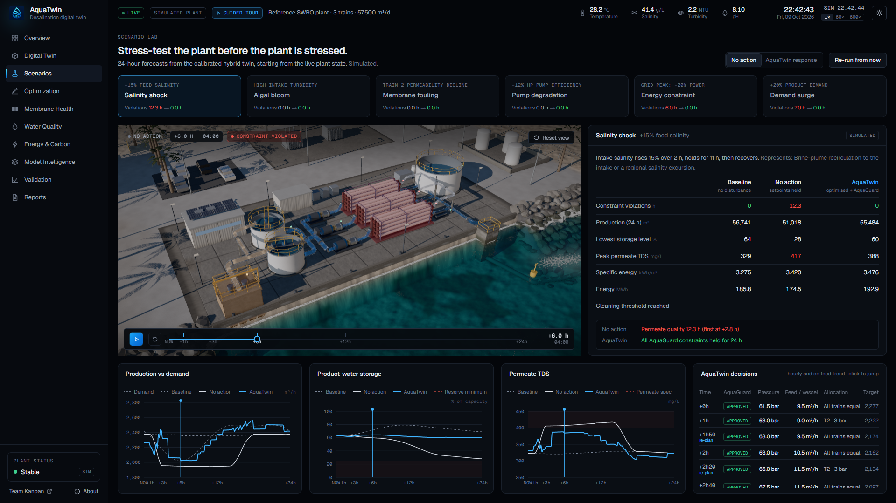<figcaption>Figure 1. Scenario Lab, salinity shock at +6 h on the <em>no action</em> branch: permeate quality breaks the 400 mg/L specification (red trains, "constraint violated"); AquaTwin's response (table) holds every limit. Simulated forecast from the live plant state.</figcaption></figure>

### 2.1 Architecture

<div class="arch">
<div class="arch-row"><div class="arch-box src"><b>01 Sensor data</b><span>telemetry (simulated plant)</span></div><div class="arch-arrow">→</div><div class="arch-box"><b>02 Physics</b><span>0D solution–diffusion, self-calibrated θ̂</span></div><div class="arch-arrow">→</div><div class="arch-box"><b>03 Residual ML</b><span>gradient-boosted trees + conformal intervals + OOD</span></div><div class="arch-arrow">→</div><div class="arch-box"><b>04 Degradation</b><span>normalised health, fitted fouling model</span></div></div>
<div class="arch-row"><div class="arch-box"><b>05 Forecasting</b><span>threshold forecasts, 24-h scenarios</span></div><div class="arch-arrow">→</div><div class="arch-box"><b>06 Optimiser</b><span>676 candidates, weighted objectives</span></div><div class="arch-arrow">→</div><div class="arch-box guard"><b>07 AquaGuard</b><span>hard limits at the interval edge; approve / reject / withhold</span></div><div class="arch-arrow">→</div><div class="arch-box op"><b>08 Operator</b><span>advisory, shadow mode</span></div></div>
</div>

The application is a single-page web app (Next.js, React, TypeScript) with no server-side computation. Two Web Workers run the models: one advances the live plant and the twin once per second, the other computes scenario forecasts, optimisations and diagnostics on demand. The 3D twin is rendered with three.js (WebGL2). The machine-learning models are trained offline in Python (scikit-learn), exported as JSON and evaluated in the browser by a small TypeScript runtime whose predictions match scikit-learn's to within 10⁻⁹. **One simulation core is shared by the application, the experiments, the unit tests and the dataset generator**, so the numbers on screen, in the experiments and in this report come from the same code.

## 3. What is new

1. **Self-calibrating physics with a learned residual, in the loop.** The physics model is re-identified from telemetry at every sample and the ML model corrects only what the physics cannot represent. This keeps extrapolation physically sensible (outside the envelope the hybrid's error grows 2.5×, the pure ML model's 3.6×) while matching the plant closely inside it.
2. **Uncertainty-aware safety that can abstain.** Limits are checked at the edge of calibrated prediction intervals, and recommendations are withheld when inputs leave the training distribution: a compound extreme is detected, confidence drops to 35 %, AquaGuard withholds with a stated reason.
3. **Model-based normalisation.** Normalised membrane performance, usually computed with empirical correction factors, is computed with the calibrated hybrid model at standard conditions, giving a direct "observed vs clean expectation vs unexplained loss" explanation of why a train is flagged.
4. **"No action vs AquaTwin" for every disturbance.** The Scenario Lab turns the twin into a rehearsal tool: operators see, hour by hour, what happens if they do nothing and what the twin would do instead, with every decision's AquaGuard verdict.
5. **A validation harness with hidden truth.** A higher-fidelity reference plant with hidden state lets us measure accuracy, constraint violations, energy and warning lead time against ground truth, reproducibly, and results the method does not win are reported alongside those it does.

## 4. Scientific and technical rigor

### 4.1 Evaluation principle: a hidden plant

A digital twin cannot be validated against itself. We built two models of different fidelity:

- a **reference plant** that stands in for the real facility: element-by-element solution–diffusion transport with film-theory concentration polarisation, the non-ideal seawater osmotic pressure of Sharqawy et al. as implemented in WaterTAP [13, 14], pump curves, pressure-exchanger mixing and leakage [15], membrane compaction, and a hidden, element-level fouling state that evolves with flux and feed conditions;
- **AquaTwin's own model**, which sees only noisy telemetry of that plant.

The two differ deliberately in structure (lumped vs element-level, linear vs non-linear osmotic pressure, salt-transport temperature dependence, energy recovery). That model-form gap is realistic (every engineering model of a real plant has one), and it is what the ML residual must learn. Because the reference plant's true state is known, every claim can be tested exactly.

### 4.2 Physics layer and self-calibration

Each RO train is described by a reduced-order (0D) solution–diffusion model: water flux J = A·TCF(T)·(P − ΔP/2 − P<sub>p</sub> − Δπ), log-mean bulk concentration with a constant polarisation factor, salt flux from B, a pressure-drop law and a lumped energy balance with energy recovery. Temperature correction follows the membrane manufacturer [12]. At every sample the model is inverted on the measurements to identify the lumped parameters (water permeability A, salt permeability B, the pressure-drop coefficient and pump efficiency), which are smoothed with an exponential filter. This mirrors the normalisation practice of ASTM D4516 [11], with the calibrated model replacing empirical correction factors.

### 4.3 Machine-learning residual

A gradient-boosted tree ensemble (scikit-learn HistGradientBoosting [16], fixed seed, no early stopping) learns the residual between the calibrated physics prediction and the plant for four targets: permeate flow, permeate TDS, vessel pressure drop and RO power. Inputs are the what-if operating point, the calibration point and seawater conditions, the calibrated parameters and the physics outputs. The training data reproduce the operational task: calibrate on six noisy samples at one operating point, predict the plant at another (what-if, normalisation or changed seawater); labels are single noisy measurements. The dataset has 40,000 training, 8,000 calibration and 8,000 test samples inside the envelope (36–48 g/L, 18–36 °C, fouling up to 30 %) and 6,000 test samples outside it. An ML-only model with the same learner, data and budget is the baseline, following the physics-guided ML literature [17].

### 4.4 Uncertainty and knowing when not to answer

Every prediction carries a 90 % interval from split conformal prediction [18], computed separately for near and far what-if extrapolations (Mondrian conformal). The Mahalanobis distance of the current inputs from the training data [19], relative to its 99th percentile, gives a confidence score; if any input leaves its training range, confidence is capped. Below 50 % confidence AquaGuard withholds every recommendation.

### 4.5 Health, degradation and forecasting

Normalised permeate flow, salt passage and pressure drop are computed by querying the calibrated hybrid model at fixed standard conditions and dividing by the post-clean baseline. A lumped fouling model, dφ/dt = κ̂·F·(J/J<sub>ref</sub>)²·(1 − φ/φ<sub>max</sub>), is fitted on synthetic operating history and used to forecast beyond the data. All three manufacturer cleaning criteria [12] are checked continuously; the time to the flow criterion is forecast from the recent trend with a 90 % band and a probability of crossing within a horizon.

### 4.6 Decisions: planning, optimisation and AquaGuard

A production planner converts demand, storage level and any announced power cap into minimum, maximum and target production. The optimiser enumerates 676 strategies (common feed pressure × feed flow per vessel × allocation of the weakest train) and ranks admissible ones by a weighted sum of specific energy, permeate quality, production tracking, membrane stress and fouling rate; weights are editable, but constraints are never traded off. AquaGuard checks 12 hard limits (feed pressure, permeate TDS, recovery, flux, concentrate and feed flow per vessel, vessel pressure drop, motor rating, minimum production, power cap, setpoint ramp and model confidence) at the conservative edge of each prediction interval. Its rules are plain comparisons; nothing in it is learned.

Because a decision is held for an hour, the optimiser also looks ahead: the feed salinity and temperature trend of the last hour is extrapolated over the decision interval, and the best-scoring strategy that still satisfies the limits under that feed is recommended. Between hourly decisions AquaTwin checks every ten minutes whether its setpoints would still pass this check, and re-plans at once if they would not (at most every 20 minutes, never while advice is withheld).

### 4.7 Validation design

We asked four questions: (1) does the hybrid predict better than physics or ML alone, inside and outside its training envelope; (2) are its uncertainty estimates honest and does it recognise out-of-envelope conditions; (3) in closed loop, does better prediction reduce constraint violations, and at what energy cost; (4) does model-based monitoring warn earlier than conventional alarms?

For (1)–(2) we use the held-out test sets. For (3)–(4) we run 24-hour closed-loop simulations on the reference plant for ten scenarios (normal operation, salinity shock, temperature shock, membrane fouling, pump degradation, sensor degradation, algal bloom, energy constraint, demand surge and a compound extreme outside the envelope) with four methods: fixed operation (setpoints held), and AquaTwin's optimiser and AquaGuard driven by the physics-only, ML-only or hybrid model. Each combination runs with five sensor-noise seeds (200 runs). The plant is simulated in 10-minute steps; each run starts at 14:00 with product storage at 55 % (reserve minimum 25 %). Warnings count only if they relate to the event they precede. The salinity, power-cap and demand scenarios are repeated at six start times and three storage levels (seed 1). The complete tables are in `docs/VALIDATION.md`, generated directly from the result files.

### 4.8 Results

<figure class="wide">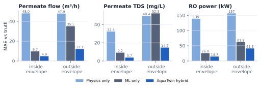<figcaption>Figure 2. Mean absolute error against noise-free truth, per train, on 8,000 held-out samples inside and 6,000 outside the training envelope. Simulated data.</figcaption></figure>

**Prediction.** The hybrid is the most accurate model on every target inside the envelope: for permeate flow 4.9 m³/h, close to the 3.0 m³/h noise floor of a single measurement, against 48.0 for calibrated physics and 9.7 for ML alone; for permeate TDS 3.7 mg/L against 32.4 and 9.2. Outside the envelope the ML-only model loses most of its advantage (35.1 m³/h), while the hybrid degrades less (12.1 m³/h) because its physics backbone still extrapolates in the right direction.

<div class="two" markdown="1"><figure>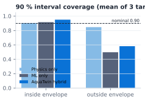<figcaption>Figure 3. Coverage of the 90 % prediction intervals.</figcaption></figure><div markdown="1">

**Uncertainty.** Inside the envelope the intervals cover 90–98 % of outcomes, as designed. Outside it the learned models under-cover sharply (hybrid permeate flow 54 %): the intervals are no longer trustworthy, which is precisely why AquaTwin does not rely on them there. The withhold rule flags 77 % of out-of-envelope samples (all salinity and combined excursions, 99 % of temperature excursions) against 0.01 % of in-envelope samples. Heavier-than-seen fouling alone is flagged in only 7 % of cases, because it changes the plant rather than its operating conditions; health monitoring covers that case.

</div></div>

<figure class="wide">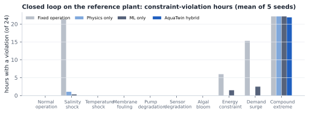<figcaption>Figure 4. Hours with any constraint violation on the true plant, mean of five seeds. Simulated.</figcaption></figure>

**Closed loop.** In six of ten scenarios no method violates a limit: the plant runs inside a comfortable envelope. Where the disturbance matters the difference is large: under the salinity shock fixed operation breaks the permeate-quality specification for 12.0 h and the storage minimum for 13.2 h (21.3 h with any violation); all three AquaTwin variants none. Under the power cap and the demand surge, fixed operation violates for 6.0 h and 15.3 h; the hybrid and physics-only loops for zero hours, the ML-only loop for 1.6 h and 2.5 h.

<figure class="wide">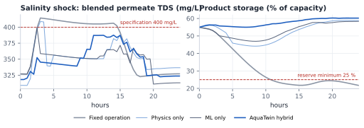<figcaption>Figure 5. Salinity shock, seed 1: permeate TDS and product storage for the four methods. AquaTwin raises pressure and production early, keeping quality below 400 mg/L and storage well above the 25 % reserve. Simulated.</figcaption></figure>

**Start time and storage.** The robustness sweep separates the models more clearly than the main runs:

| Runs with a violation (of 18) | Fixed operation | Physics only | ML only | AquaTwin hybrid |
|---|---|---|---|---|
| Storage at 35 % | 18 | 11 | 12 | 7 |
| Storage at 55 % | 18 | 4 | 8 | **0** |
| Storage at 75 % | 18 | 0 | 1 | **0** |

From 55 % and 75 % storage the hybrid has no violation at any start time. From 35 %, only 10 percentage points above the reserve, no method avoids every violation: the hybrid's are storage-reserve violations under the demand surge (3 of 6 start times) and the power cap (4 of 6), where AquaTwin treats the grid cap as a hard limit and lets storage fall, whereas fixed operation keeps storage but runs above the cap. Two caveats: the sweep uses one seed, and it is not an independent test of two controller features added after failures were observed (the feed look-ahead and the unscheduled re-plan, §4.6), both general mechanisms applied equally to all three model variants.

<div class="two"><figure>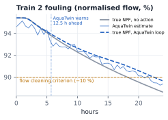<figcaption>Figure 6. Train 2 biofouling: true normalised flow, AquaTwin's estimate from noisy data, and the warning. Simulated.</figcaption></figure><figure>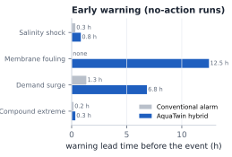<figcaption>Figure 7. Warning lead time before the first critical event (no-action runs, mean of seeds). Simulated.</figcaption></figure></div>

**Early warning.** For slow processes the gain is substantial: AquaTwin warns 12.5 h before Train 2 reaches the flow cleaning criterion (−10 %), while conventional alarms give no warning within the day; it forecasts storage depletion 6.8 h ahead against 1.3 h for a low-level alarm. For fast quality events the gain is minutes (50 min vs 20 min for the salinity shock), because the disturbance ramps within two hours. No false warnings were raised in normal operation by any method. In this experiment Train 2 starts with a normalised pressure drop about 20 % above its clean baseline, which already meets the manufacturer's pressure-drop criterion at t = 0, and AquaTwin reports that immediately; the lead time above concerns the flow criterion, which alarms on absolute values miss.

<figure class="wide">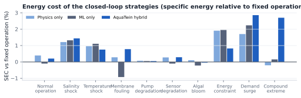<figcaption>Figure 8. Specific energy consumption relative to fixed operation. Simulated.</figcaption></figure>

**Energy, honestly.** Avoiding violations is not free: the hybrid loop uses between 0 % and 2.8 % more energy per cubic metre than fixed operation, most in the demand surge (where it also produces 12 % more water). We do not claim energy savings. In the compound extreme outside the envelope every method violates limits for 21–22 of 24 hours; AquaTwin withholds its recommendation 20 times. Abstention limits harm (it prevents confident but wrong advice), but it does not solve the problem; a human decision is required.

### 4.9 What the results do and do not show

On a realistic simulated plant with a deliberate model-form gap, a self-calibrating hybrid twin predicts better than either physics or ML alone, recognises most out-of-envelope conditions, prevents constraint violations under several disturbances at a modest energy cost, and gives useful warning of slow degradation. The results do not show performance on a real plant: the reference plant is itself a model, the residual is trained on data from it, and real plants have phenomena neither model contains.

### 4.10 Reproducibility and quality assurance

Fixed seeds throughout (20261101 for data and models; 1–5 for sensor noise); one command regenerates the dataset, models, parity check and all experiments in about ten minutes, and rerunning reproduced every artefact bit for bit apart from timestamps (Appendix B). 31 unit tests cover physics balances, seawater properties, the calibration round trip, AquaGuard verdicts, cleaning criteria, forecasting, the feed look-ahead, closed-loop re-planning and ML parity; type checking, lint, automated browser QA of every page at desktop, phone and tablet sizes, and rendering-performance measurements complete the checks. The annotated reference list (`docs/REFERENCES.md`) records what was and was not verified in each source.

### 4.11 Limitations

- **Simulated plant.** Real plants include scaling chemistry, vessel-to-vessel heterogeneity, control-loop dynamics and instrument faults that neither model contains.
- **Synthetic training data.** The residual is trained on data from the plant it is evaluated on; out-of-envelope tests and model-form differences mitigate but do not remove this optimism.
- **Steady-state models.** Minute-scale hydraulic and control transients are not modelled; decisions are hourly, with re-plans at most every 20 minutes.
- **Water quality.** Only total dissolved solids are modelled; boron, which single-pass SWRO rejects poorly and which has a WHO guideline value [20], is not.
- **Fouling.** The degradation model is lumped and fitted to one profile; scaling and chemical degradation are not modelled; heavier-than-seen fouling is poorly detected by the out-of-distribution rule.
- **Energy and carbon.** The plant's specific energy (≈ 3.3 kWh/m³) is at the efficient end of published ranges because auxiliary loads are assumptions; comparisons between strategies are meaningful, absolute values are not plant-specific. Carbon uses an average grid factor [21].
- **Sensor faults and low storage.** Sensor drift propagates into all models; starting close to the storage reserve, long disturbances drain storage below the reserve with every method; AquaTwin reduces how often, but does not prevent it.

## 5. Alignment with the UN Water pillars and SDG 6: impact and policy brief

### 5.1 The hackathon's six themes

The hackathon's six themes are aligned with the UN Water pillars [22]. AquaTwin is entered under Theme 3 and contributes to the other five, strongly to three of them:

| Theme | Contribution | Mechanism and evidence |
|---|---|---|
| **3 · Smart, digital and AI-enabled water systems** | **Primary** | Physics-informed AI twin with calibrated uncertainty and deterministic safety; 4.9 m³/h prediction error (§4.8). |
| 1 · Water security and sustainable desalination | Strong | Keeps SWRO output on specification and on demand through Gulf stresses: 21.3 h → 0 h of violations under a salinity shock; storage managed ahead of power caps and demand surges. |
| 4 · Water quality, health and environmental protection | Strong | Permeate quality is a hard limit checked at the interval edge; 2-hour quality outlook; algal-bloom scenario; brine discharge made visible. |
| 5 · Energy–water nexus and climate resilience | Strong | Energy and carbon are first-class objectives; grid power caps are honoured by pre-filling storage; heat and salinity extremes are rehearsed; the energy cost of resilience is reported (0 to +2.8 %). |
| 6 · Integrated systems, governance and cooperation | Supporting | Auditable by design: every number labelled by provenance, every recommendation states the limits it was checked against, abstention outside the envelope; open, reproducible methods. |
| 2 · Water reuse, circularity and resource efficiency | Supporting | Cleaning planned from a forecast rather than triggered by a threshold, expected to mean fewer emergency clean-in-place cycles (whose spent acid and alkaline solutions form a chemical waste stream [23]) and longer membrane life through stress-aware operation. Both are hypotheses to test in Phases 1–2. |

### 5.2 Sustainable Development Goals

- **SDG 6.1** (*safe and affordable drinking water for all* [24]): fewer hours off-specification or below demand at the plants that supply it.
- **SDG 6.4** (*water-use efficiency and sustainable supply to address water scarcity* [24]): higher availability of existing desalination capacity, with cleaning and maintenance planned rather than forced.
- **SDG 6.a** (*international cooperation and capacity-building … including desalination* [24]): an open, reproducible, browser-based tool that utilities and universities in water-scarce countries can study, adapt and teach with; the Scenario Lab doubles as an operator-training simulator.
- **SDG 6.3** (*minimizing release of hazardous chemicals* [24]): fewer emergency chemical cleanings are expected when cleaning is planned (to be measured in Phases 1–2).
- **SDG 7, 9 and 13**: energy is a first-class objective; software-only retrofit of existing infrastructure; resilience to heat and salinity extremes that climate change makes more frequent.

### 5.3 SDG 6 Global Acceleration Framework

UN-Water's framework names five accelerators [25]. AquaTwin turns plant data into decisions (**data and information**), is an applied AI innovation for operations (**innovation**), trains operators on disturbances before they happen (**capacity development**), makes AI decisions auditable and abstains when unsure (**governance**), and protects the value of existing desalination assets rather than requiring new capital (**financing**).

### 5.4 The 2026 UN Water Conference

The 2026 UN Water Conference, co-hosted by the UAE and Senegal in Abu Dhabi on 8–10 December 2026, organises its dialogues around Water for People, Prosperity, Planet and Cooperation, Water in Multilateral Processes and Water in Investments [26]. AquaTwin speaks to **People** (reliable, safe drinking water), **Prosperity** (supply security for cities and industry), **Planet** (energy-aware operation, fewer chemical cleanings, visible brine discharge), **Cooperation** (open methods any utility can inspect) and **Investments** (more value from installed capacity through software).

### 5.5 Environmental and social consequences

| Benefit | Risk | Mitigation |
|---|---|---|
| Fewer off-specification hours and supply interruptions | Automation bias: operators trusting advice too much | Advisory by default; AquaGuard reasons shown; withholds when unsure; operator confirmation required (§7.3) |
| Cleaning planned earlier; fewer emergency chemical cleanings | Resilience can cost energy (0 to +2.8 % here) | Energy and carbon reported for every strategy; weights editable; cost of resilience visible |
| Operator training through rehearsal | Cybersecurity exposure of plant data | Read-only, one-way data flow; on-premises deployment; IEC 62443-aligned zoning (§6.1) |
| Transparent, auditable AI | Skills displacement concerns | Positioned as decision support that augments operators; training material built in |

### 5.6 Policy recommendations

1. **Make uncertainty-aware abstention a requirement for AI advice in critical water infrastructure.** Systems should state their confidence and decline to advise outside their validated envelope, consistent with the human-oversight principles of the EU AI Act (Art. 14), which lists AI used as a safety component in water supply among high-risk systems [27], and with joint cybersecurity-agency guidance that advises keeping a human in the loop for AI in operational technology [28].
2. **Stage adoption through shadow mode.** Utilities and regulators should expect months of logged, read-only operation, compared against operator decisions and outcomes, before any AI advice is offered for confirmation, consistent with the joint guidance to test AI on non-production systems before production use [28].
3. **Label data provenance.** Every number shown to an operator should say whether it is measured, modelled, estimated or assumed, as AquaTwin's are.
4. **Build shared, hidden-truth benchmarks.** A public reference-plant simulator (like AquaTwin's) lets vendors and utilities compare digital twins reproducibly before field trials.
5. **Link to national strategy.** In the UAE, digital twins of desalination plants support the Water Security Strategy 2036 aims of continuous supply in normal and emergency conditions and two days of national storage [4]: planning production around storage, power caps and seawater events is what AquaTwin's planner does.

## 6. Feasibility and scalability

### 6.1 Technical feasibility

- **Data.** Every model input is a standard SWRO measurement already stored in plant historians; no new sensors are needed. Training uses the same pipeline with historian data in place of synthetic data.
- **Integration.** A read-only connector to the historian or SCADA through OPC UA (IEC 62541), the platform-independent industrial interoperability standard [29], replaces the simulated plant; everything else is unchanged.
- **Compute.** The complete twin, optimiser and 24-hour scenarios run in a browser tab today; a plant deployment runs the same TypeScript core on a single on-premises server or edge PC, with no GPU cluster and no cloud dependency.
- **Cybersecurity.** One-way, read-only data flow through the plant's DMZ, aligned with the ISA/IEC 62443 series for industrial automation and control systems [30]; nothing writes to the control system until a later, separately approved phase.
- **Safety.** AquaGuard is deterministic and testable; its limits are set from the plant's own operating envelope and approved by the plant's engineers.

### 6.2 Implementation pathway and resources

| Phase | Scope | Indicative resources | Exit criterion |
|---|---|---|---|
| 0 · Prototype (done) | Hybrid twin, AquaGuard, Scenario Lab, reproducible validation on a simulator | Team Kanban | This report |
| 1 · Historian back-test (≈ 3 months) | Configure the host plant (trains, vessels, limits); retrain the residual on 12+ months of historian data; back-test predictions, health indicators and warnings against recorded events | Process engineer, data scientist and software engineer, part-time; read-only data access | Accuracy and coverage on held-out months; no missed cleaning events |
| 2 · Shadow mode (≈ 6 months) | Live read-only connection; advice logged, never applied; weekly review with operators | On-premises server; plant IT/OT security review | AquaGuard never approves an unsafe strategy; agreement and benefit analysis |
| 3 · Operator-confirmed advice | Selected recommendations offered for confirmation | Operator training; change-management procedure | Measured reduction in off-specification hours or unplanned cleanings |
| 4 · Fleet | Multi-plant deployment, shared model governance | Central model registry | Per-plant validation |

The main cost is plant-specific commissioning and validation (engineering time), not hardware or licences: the software stack is open source. A host utility or plant operator is needed from Phase 1; no such partnership exists today.

### 6.3 Scalability

The plant configuration (trains, vessels, elements, limits) is data, not code, so the same twin applies to other SWRO trains and plants; each plant gets its own calibrated physics and retrained residual. The design extends to a fleet view across plants, to brackish-water RO and nanofiltration (same transport physics, different parameters), and to central deployment feeding many operator screens. Because the physics carries the extrapolation, a new plant needs far less data than a purely data-driven model, and the hidden-plant harness can test each new configuration before it goes live.

### 6.4 Risks

| Risk | Likelihood | Mitigation |
|---|---|---|
| Real-plant behaviour outside both models (scaling, instrument faults) | Medium | Historian back-test before any live use; withhold rule; sensor validation added in Phase 1 |
| Data access and cybersecurity approval delays | Medium | Read-only, on-premises design; OPC UA; early engagement with the plant's OT security team |
| Operator trust (too little or too much) | Medium | Shadow mode; reasons for every verdict; abstention; training through the Scenario Lab |
| Model drift as membranes age | High (expected) | Continuous self-calibration; scheduled retraining; drift monitoring on residuals |

## 7. Industry relevance and adoption potential: industry-adoption roadmap

### 7.1 Who it is for, and what it gives them

| Stakeholder | Value |
|---|---|
| Plant operators and shift supervisors | Early warning, rehearsed responses, clear reasons: fewer surprises |
| Process and maintenance engineers | Normalised health and cleaning forecasts per train; what-if analysis without touching the plant |
| Utilities and plant owners (IWP operators) | Higher availability of existing assets; compliance with water-quality limits; auditable decisions |
| Regulators and water authorities | Transparent, conservative AI with provenance and abstention built in |
| Membrane and equipment suppliers | Model-based performance evidence for warranties and service contracts |

**Why now.** Desalination capacity is concentrated where AquaTwin is designed to work (the Middle East and North Africa produce 48 % of the world's desalinated water [1]), and energy is between one-third and nearly one-half of SWRO recurrent costs [9], so operation quality has direct cost and supply-security value. Digital twins are moving from design tools to operations in the water sector [31, 32]; AquaTwin's contribution is making one trustworthy enough for operations.

### 7.2 The autonomy ladder

The registered title speaks of *autonomous* optimisation. We treat autonomy as a destination reached in auditable steps, never a starting point:

| Level | AquaTwin's role | Human role | Entry condition |
|---|---|---|---|
| L0 Monitor | Health, forecasts, scenarios | Operates as today | Phase 1 back-test passed |
| L1 Advise (shadow) | Recommendations logged, not shown | Unchanged; outcomes compared | Phase 2 |
| L2 Advise (confirmed) | Recommendations shown with AquaGuard verdicts | Confirms or rejects each change | Shadow-mode evidence |
| L3 Supervised autonomy | Applies AquaGuard-approved setpoints inside a narrow envelope | Supervises; can override or stop at any time | Sustained L2 record; regulator and owner approval |

AquaGuard's abstention, deterministic limits and stated reasons are what make each step auditable; L3 keeps the override and stop controls that human-oversight rules require [27].

### 7.3 Business model and go-to-market

- **Offer:** per-train annual licence for an on-premises deployment, with a commissioning package (Phases 1–2) priced per plant; the validation harness offered as a service for plant upgrades.
- **First customer:** a pilot with a UAE SWRO plant operator for a historian back-test, then shadow mode. The UAE combines a large SWRO fleet, a national water-security strategy and the 2026 UN Water Conference as a showcase.
- **Partners:** membrane and ERD suppliers (performance services), OT integrators (OPC UA connectors), universities (operator training with the Scenario Lab).

### 7.4 Fit with industry practice and standards

AquaTwin uses the industry's own language: ASTM D4516 normalisation [11], the manufacturer's cleaning criteria [12], OPC UA for data [29] and IEC 62443 for security [30]. Its outputs (normalised flow, salt passage, pressure drop, specific energy) are the quantities plant engineers already report.

## 8. Communication and presentation

- **A product, not a slide.** The prototype is live at [aquatwin.kanbanstudios.ae](https://aquatwin.kanbanstudios.ae): eleven views (Overview, Digital Twin, Scenario Lab, Optimization, Membrane Health, Water Quality, Energy & Carbon, Model Intelligence, Validation, Reports, About), a cinematic first-visit intro and a realistic 3D twin of a coastal plant. A guided tour walks first-time visitors through the evidence in six steps; light and dark themes and laptop-first layouts keep the twin and its key numbers on one screen. It runs in any modern browser, on phones and tablets too. Appendix A shows the main views.
- **Honest by design.** Every number on screen is labelled *simulated*, *modeled*, *estimated*, *assumed* or *external reference*; validation results are read directly from the result files, nothing is typed by hand.
- **The one-minute film.** A narrated motion-graphics pitch built from the real application and the real simulation results, with burned-in subtitles.
- **Open documentation.** Model equations and parameter provenance (`docs/MODEL.md`), validation tables (`docs/VALIDATION.md`), architecture (`docs/ARCHITECTURE.md`), references with verification notes (`docs/REFERENCES.md`), QA report (`docs/QA.md`), all in the public repository [github.com/4waiz/AquaTwin](https://github.com/4waiz/AquaTwin).

## 9. Conclusion

AquaTwin shows that a digital twin for seawater desalination can be accurate, anticipatory and conservative at the same time. Grounding machine learning in a self-calibrating physical model gives better predictions than either alone and fails more gracefully; wrapping every recommendation in deterministic, uncertainty-aware limits, and abstaining outside the validated envelope, makes it fit for the way critical water infrastructure is run. On a hidden simulated plant it removed constraint violations under salinity, power and demand stresses, warned of membrane fouling half a day ahead, and told the truth when it could not help. The next step is the one no simulator can replace: a plant historian and a period of shadow operation.

*Predict. Simulate. Adapt. Before the plant is forced to react.*

## References

<div class="refs" markdown="1">

1. Jones, E., Qadir, M., van Vliet, M.T.H., Smakhtin, V., Kang, S. (2019). The state of desalination and brine production: a global outlook. *Science of the Total Environment* 657:1343–1356. https://doi.org/10.1016/j.scitotenv.2018.12.076
2. UAE Government portal (u.ae). *Water*: desalination as a key source; installed capacity 7.8 million m³/day (2023, FCSC).
3. ACWA Power. *Taweelah RO Desalination IWP* (project page). https://acwapower.com/en/what-we-do/projects/taweelah-ro-desalination-iwp/
4. UAE Government portal (u.ae). *The UAE Water Security Strategy 2036* (updated 25 August 2026).
5. Sheppard, C., et al. (2010). The Gulf: a young sea in decline. *Marine Pollution Bulletin* 60(1):13–38. https://doi.org/10.1016/j.marpolbul.2009.10.017
6. Miyakawa, H., et al. (2021). Reliable seawater RO operation with high water recovery and no-chlorine/no-SBS dosing in the Arabian Gulf. *Membranes* 11(2):141. https://doi.org/10.3390/membranes11020141
7. Schunke, A.J., et al. (2020). Energy recovery in SWRO desalination: current status and new possibilities. *Frontiers in Sustainable Cities* 2:9. https://doi.org/10.3389/frsc.2020.00009
8. Gude, V.G., Fthenakis, V. (2020). Energy efficiency and renewable energy utilization in desalination systems. *Progress in Energy* 2(2):022003. https://doi.org/10.1088/2516-1083/ab7bf6
9. World Bank (2019). *The Role of Desalination in an Increasingly Water-Scarce World*. Water Global Practice Technical Paper, p. xix.
10. Anderson, D.M., Boerlage, S.F.E., Dixon, M.B. (Eds.) (2017). *Harmful Algal Blooms and Desalination: A Guide to Impacts, Monitoring and Management*. IOC Manuals and Guides 78, IOC-UNESCO.
11. ASTM International (2019). ASTM D4516-19a, *Standard Practice for Standardizing Reverse Osmosis Performance Data*. https://doi.org/10.1520/D4516-19A
12. DuPont (2026). *FilmTec™ Reverse Osmosis Membranes Technical Manual*, Form 45-D01504-en, Rev. 20; FilmTec™ SW30 product data sheets.
13. WaterTAP (watertap-org). Seawater property package and reverse-osmosis unit models. https://watertap.readthedocs.io
14. Sharqawy, M.H., Lienhard V, J.H., Zubair, S.M. (2010). Thermophysical properties of seawater: a review of existing correlations and data. *Desalination and Water Treatment* 16:354–380. https://doi.org/10.5004/dwt.2010.1079
15. Energy Recovery, Inc. (2025). *PX Q400: Highly Efficient Energy Recovery Device*, white paper.
16. Pedregosa, F., et al. (2011). Scikit-learn: machine learning in Python. *JMLR* 12:2825–2830.
17. Willard, J., Jia, X., Xu, S., Steinbach, M., Kumar, V. (2023). Integrating scientific knowledge with machine learning for engineering and environmental systems. *ACM Computing Surveys* 55(4). https://doi.org/10.1145/3514228
18. Angelopoulos, A.N., Bates, S. (2023). Conformal prediction: a gentle introduction. *Foundations and Trends in Machine Learning* 16(4):494–591. https://doi.org/10.1561/2200000101
19. Lee, K., Lee, K., Lee, H., Shin, J. (2018). A simple unified framework for detecting out-of-distribution samples and adversarial attacks. *NeurIPS* 31. https://arxiv.org/abs/1807.03888
20. World Health Organization (2022). *Guidelines for Drinking-water Quality*, 4th ed. incorporating the 1st and 2nd addenda; WHO (2011), *Safe drinking-water from desalination*.
21. Ember (2026), via Our World in Data. Lifecycle carbon intensity of electricity generation (UAE 2024: 0.468 kg CO₂e/kWh).
22. Khalifa University (27 August 2026). *Khalifa University Launches Global Water Hackathon 2026 to Accelerate Solutions to Global Water Challenges* (news release): themes, evaluation criteria and expected outputs.
23. UNEP / WHO (2008). *Desalination Resource and Guidance Manual for Environmental Impact Assessments* (ed. S. Lattemann), pp. 102–103; Lattemann, S., Höpner, T. (2008). Environmental impact and impact assessment of seawater desalination. *Desalination* 220:1–15. https://doi.org/10.1016/j.desal.2007.03.009
24. United Nations (2015). *Transforming our world: the 2030 Agenda for Sustainable Development* (A/RES/70/1); Goal 6 targets, https://sdgs.un.org/goals/goal6
25. UN-Water (2020). *The Sustainable Development Goal 6 Global Acceleration Framework*. Geneva.
26. United Nations. *2026 United Nations Water Conference* (Abu Dhabi, 8–10 December 2026), https://sdgs.un.org/conferences/water2026; General Assembly resolution A/RES/78/327.
27. Regulation (EU) 2024/1689 (Artificial Intelligence Act), Annex III point 2 and Article 14, as amended by Regulation (EU) 2026/1744.
28. CISA, ASD's ACSC, NSA, FBI, CCCS, BSI, NCSC-NL, NCSC-NZ, NCSC-UK (2025, rev. 2026). *Principles for the Secure Integration of Artificial Intelligence in Operational Technology*.
29. OPC Foundation. *OPC Unified Architecture* (IEC 62541). https://opcfoundation.org/about/opc-technologies/opc-ua/
30. ISA / IEC. *ISA/IEC 62443 Series of Standards*: security for industrial automation and control systems.
31. Ghorbani Bam, P., et al. (2025). Digital twin applications in the water sector: a review. *Water* 17(20):2957. https://doi.org/10.3390/w17202957
32. Torfs, E., et al. (2022). The transition of WRRF models to digital twin applications. *Water Science and Technology* 85(10):2840–2853. https://doi.org/10.2166/wst.2022.107

</div>

Annotated reference notes: `docs/REFERENCES.md` and `docs/research/submission-fact-check.md`; model equations and parameter provenance: `docs/MODEL.md`.

<section class="appendix" markdown="1">

## Appendix A: The prototype

<figure class="wide">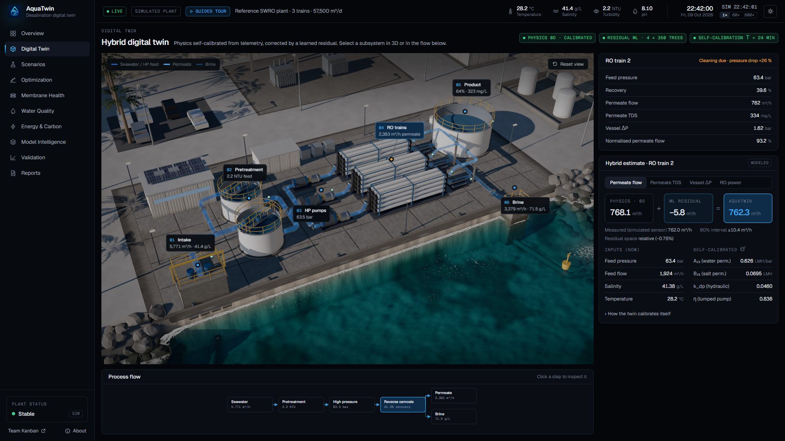<figcaption>A1. Digital Twin: for the selected train, physics estimate + ML residual = AquaTwin estimate, with the 90 % interval, the inputs and the self-calibrated parameters.</figcaption></figure>

<figure class="wide">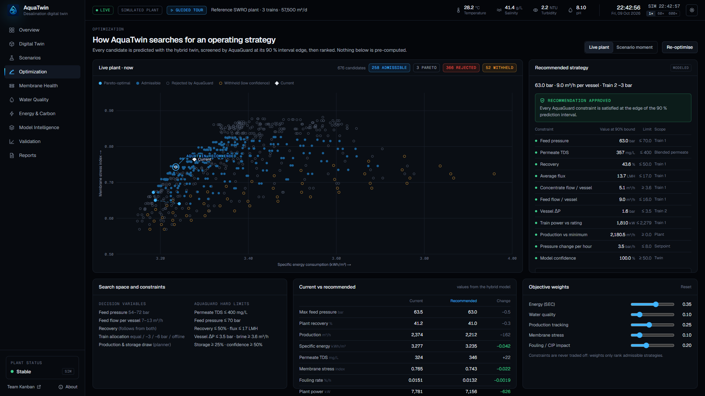<figcaption>A2. Optimization: 676 candidate strategies (specific energy vs membrane stress), Pareto set, AquaGuard verdicts and the recommended strategy against the current one.</figcaption></figure>

<figure class="wide">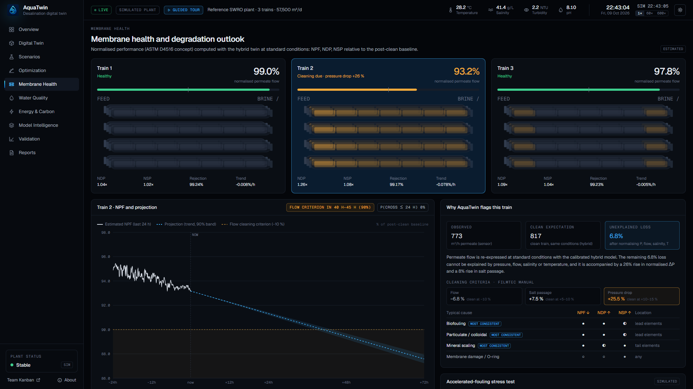<figcaption>A3. Membrane Health: normalised performance per train, projection to the cleaning threshold and why Train 2 is flagged.</figcaption></figure>

<figure class="wide">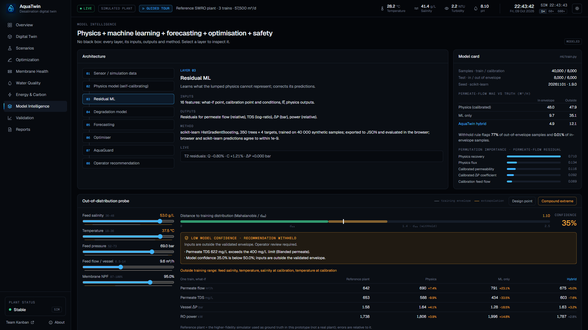<figcaption>A4. Model Intelligence: the out-of-distribution probe at a compound extreme (53 g/L, 37.5 °C). Confidence drops to 35 % and AquaGuard withholds the recommendation.</figcaption></figure>

<figure class="wide">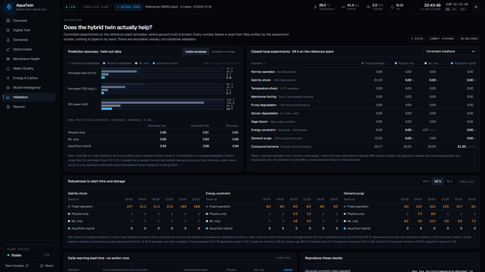<figcaption>A5. Validation: all experiment results, read directly from the result files.</figcaption></figure>

<figure class="wide">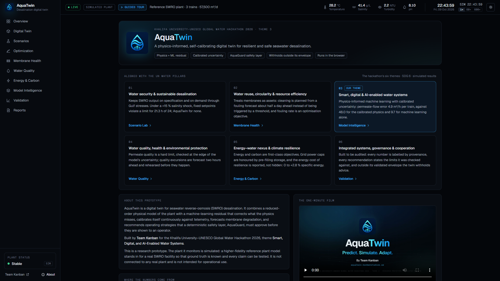<figcaption>A6. About: the hackathon themes and how AquaTwin serves each, data provenance, methods, software and disclaimers.</figcaption></figure>

## Appendix B: Reproducing the results

```
npm install
pip install -r ml/requirements.txt
npm run pipeline                         # dataset → training → parity check → experiments
python scripts/report/validation_md.py   # docs/VALIDATION.md
python scripts/report/figures.py         # report figures
python scripts/report/build.py           # this report (HTML + PDF)
npm test                                 # unit tests
```

All steps use fixed seeds (20261101 for data and models; 1–5 for sensor noise). Rerunning the pipeline reproduced the dataset, models, metrics and all 200 closed-loop runs identically apart from timestamps.

## Appendix C: Submission checklist

| Item | Status |
|---|---|
| Final report (PDF, ≤ 10 MB) | `CMAT-00022_Theme3_AwaizAhmed_Final Report.pdf` |
| One-minute video (MP4, ≤ 100 MB, ≤ 60 s) | `CMAT-00022_Theme3_AwaizAhmed_Video.mp4` (1920×1080, narrated, subtitled) |
| Registration number | CMAT-00022 |
| Theme | Theme 3: Smart, Digital, and AI-Enabled Water Systems |
| Project title | AquaTwin: A Physics-Informed AI Digital Twin for Autonomous Desalination Optimization |
| Working prototype | https://aquatwin.kanbanstudios.ae |
| Source code, data and reproduction scripts | https://github.com/4waiz/AquaTwin |
| Evaluation criteria addressed | Rubric map in the Executive summary; §4–§8 |

</section>
